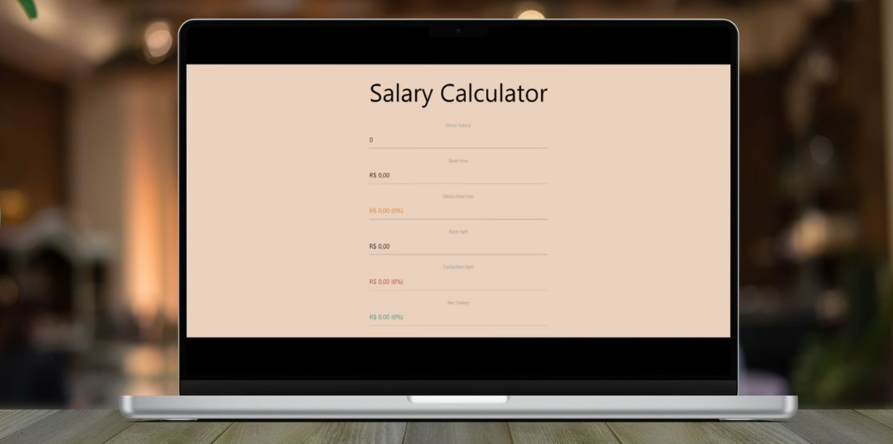

# igti-fullstack-bootcamp-desafio-3

	English | <a href="https://github.com/samlatavares/igti-fullstack-bootcamp-trabalho-3/blob/main/translations/pt-br/README.md">Português</a>

</img>

## What is this project?
Project made during the IGTI's Fullstack bootcamp. This is a React project that calculates the Net Salary based in brazilian law (CLT).

## How to configure your local environment
- Download Visual Studio Code
- Download NPM
- Clone this repository
- Run npm install in the project folder to install all required dependencies
- Run npm run start and view the app at localhost:3000 (or whichever port is shown in your terminal)